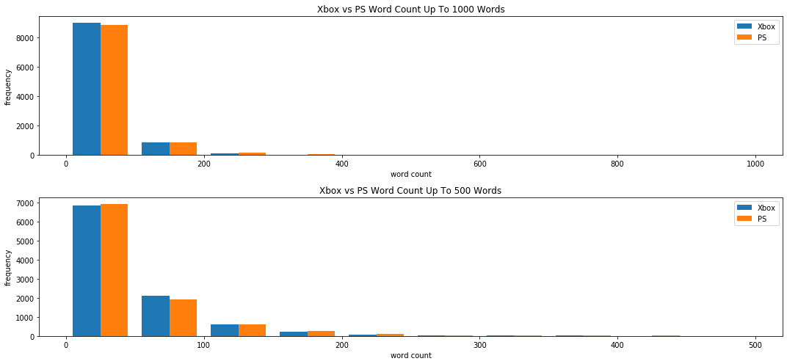

# Understanding Player's Preferences Using Reddit Data
----

## Content 
- [Problem Statement](#Problem-Statement)
- [Executive Summary](#Executive-Summary)
- [Project Files](#Project-Files)
- [Data Directory](#Data-Directory)
- [Data Collection and Cleaning](#Data-Collection-and-Cleaning)
- [EDA and Sentiment Analysis](#EDA-and-Sentiment-Analysis)
- [Modeling](#Modeling)
- [References](#References)

---

## Problem Statement

Playstation vs. Xbox, which one is better? It is a question that has plagued the gaming community. On one camp boasts its robust online community, while the other for its compelling storytelling. As an individual with friends in both spectrums, I have heard various reasons for this debate. They can range from "lack of interest in exclusive games" to "the overall software performance." In both cases, you can make an argument in favor of both consoles. However, there is still this unanswered question of what makes one console special over the other? And how does this affect the type of gamers they attract? 

For this project, I decided to conduct an analysis using the Xbox and Playstation subreddits to study the community's discussion threads. My goal is to uncover differences in gamer preference and behavior to answer the question of "Which console is better?"

---

## Executive Summary

Reddit posts are collected using the pushshift API, focusing on the Playstation 4 (r/ps4) and Xbox One (r/xboxone) subreddit. I then trained an NLP Logistic Regression model to predict a post's subreddit community. Using its coefficient, I extract unique game titles to conduct a comparative analysis with 2020's top-selling games. My findings is that exclusivity and company branding play a critical role in a console player demographics. 

---

## Project Files

- README.md
- **Code Directory**
    - function.py: Script that contains the functions used in the EDA notebook
    - 01_data_collection: Notebook that contains code related to collecting data process 
    - 02_data_cleaning: Notebook that contains code and explanation related to data cleaning process
    - 03_eda_and_sentiment_analysis: Notebook that contains the EDA step and Sentiment analysis
    - 04_modeling: Notebook that contain modeling code and coefficient analysis
    
---

## Directory

|Feature|Type|Description|
|---|---|---|
|Selftext|string|The body or content of the post|
|Title|string|Header/title of the post|
|Subreddit|string|Which subreddit the post are taken from r/xboxone or r/ps4|

---

## Data Collection and Cleaning

To answer the problem statement, I decided to collect data from the r/ps4 and r/xboxone subreddit. Since neither of the new generation consoles are out during this project's completion, focusing on those two subreddits will paint a better picture of the community's activities. Additionally, discussions for both current and new generation consoles are still happening in those threads. 

Using the Pushshift API, I collected 10,000 posts from each subreddit, totaling a collection of 20,000 posts starting from the midnight of July 17, 2020. Complying with the API regulations, I limited each request to 100 posts and slowed it down to 3 seconds per pull. For this project's purpose, I decided to use the title, selftext, and subreddit columns. Since most of the missing data are in selftext, I combined it with the title column to maintain its information. I used regex, stopwords, and lemmatization techniques to clean the data and remove common, apparent, and non-English words, resulting in a final dataset of 19973. 

---

## EDA and Sentiment Analysis

The EDA section is broken down into three categories: Word Count, Top Words, and Sentiment Analysis. For project cohesiveness, orange plots are for the PS subreddit (r/ps4), and blues are for the Xbox (r/xboxone).

1. **Word Count:** The average word count for both subreddit is 45 words/post, where most posts contain 50 words or less. Upon inspection of their distribution, I noticed that the PS subreddit has more posts with 50 words or less. In comparison, the Xbox subreddit has lengthier posts at 50-100 words. Additionally, both subreddits have a right-tail skewed distribution with plenty of outliers for both communities. The longest post is an article about Ghost of Tsushima found in the PS subreddit with 3651 words. 

2. **Top Words:** To better understand the topics discussed, I decided to examine the top words used in both subreddits. The term "game" dominates both communities. Furthermore, it appears that the majority of discussions are about troubleshooting an issue within the platform. However, there isn't an exciting finding in this category. For instance, terms such as "pass," "live," and "gold" are common words found in the Xbox subreddit, while the word "pro" appeared in the PS. Although it didn't give much information, it still gives an idea of what gamers are discussing. 

3. **Sentiment Analysis:**
I conducted a sentiment analysis to capture the attitudes of each subreddit users. The results show that both subreddit posts range from neutral to slightly positive (Xbox polarity: 0.012 and PS polarity: 0.019). Additionally, their subjectivity scores indicate that the PS (0.35) subreddit posts are somewhat more objective and the Xbox (0.38). This observation is surprising since I assumed that posts would be more opinion-based due to Reddit's nature and identity. 

---

## Modeling

I tested three models to classify Reddit posts: Multinomial Naive Bayes, Random Forest Tree, and Logistic Regression. I selected those models because they are interpretable. The baseline score for this project is 50%. All models performed similarly to each other, with accuracy scores around 72-74%. Additionally, their sensitivity scores are around 70-75%, and specificity scores between 71-76%. Since I am most comfortable interpreting Logistic Regression models, I decided to use its coefficient to isolate game titles. 

For the PS subreddit, games with high coefficients are TLOU (The Last of Us), Uncharted, Ghost of Tsushima, Spiderman, God of War, and Bloodborne. Interestingly, all games mentioned are PlayStation exclusive games. Additionally, they are action-adventure games known for their storytelling. When cross-referenced with 2020's top-selling games for Playstation (according to PS4.com), three out of the six games mentioned above (The Last of Us, God of War, and Spiderman) are among the list. A possible conclusion is that exclusivity is crucial to do well in the market.

For the Xbox subreddit, the titles that stood out are Forza, Halo, Fable, Gears of Wars, and Cyberpunk. Except for Cyberpunk, all four games are exclusives. Secondly, the majority of them are known for being serious competitive games. These findings are further emphasized in the top-selling games for Xbox One, according to Gamespot: Forza, Gears of War, Halo, Call of Duty, and Battlefield. All are known for being serious competitive games. 

---

## Recommendations

The answer to the question of "Which console is better?" is **neither**. Console preference heavily depends on the type of game a player enjoys. However, a commonality is that exclusivity matters regardless of console. Gamers value exclusive games, and it is apparent in the sales. Additionally, console branding is crucial in the type of gamers they attract. So, for Playstation, first-player action-adventure games, such as TLOU and God of war, do well in their market. A big part of this is that PlayStation has created an image of being the best in portraying storytelling in their games. In comparison, Xbox games such as Forza and Gears of War have cemented their identity as an excellent console for serious competitive gaming. 

The overall purpose of my recommendations above is to help game developers/researchers identify which console branding closely mimics their game. Thus, assisting the determination of which market the game will perform better. The motive behind this is that it takes a decent amount of time and effort to port code from one console to another due to technical specifications and differences. By identifying your market ahead of time, save resources and funding in the long term. 

This project is not definitive and still has many potentials for improvement. First, I would like to increase the data collected from each subreddits. I would also be interested in adding the PC community to this analysis. Second, I would like to explore more sophisticated modeling techniques to increase accuracy and avoid overfitting. Lastly, I would create an app that takes game description as input and produce a recommendation on which platform the game will do better in, Xbox or Playstation.

---

## References

- https://kotaku.com/how-much-does-it-cost-to-make-a-big-video-game-1501413649
- https://metro.co.uk/2019/12/05/games-inbox-the-cost-of-making-a-video-game-campo-santo-break-up-and-mario-kart-for-kids-11273380/
- https://www.pushsquare.com/news/2020/07/these_are_the_five_best-selling_ps4_exclusives_in_the_us
- https://www.windowscentral.com/list-xbox-one-best-selling-games-all-time
- https://www.gamespot.com/articles/top-10-best-selling-xbox-one-games-and-exclusives-/1100-6470080/