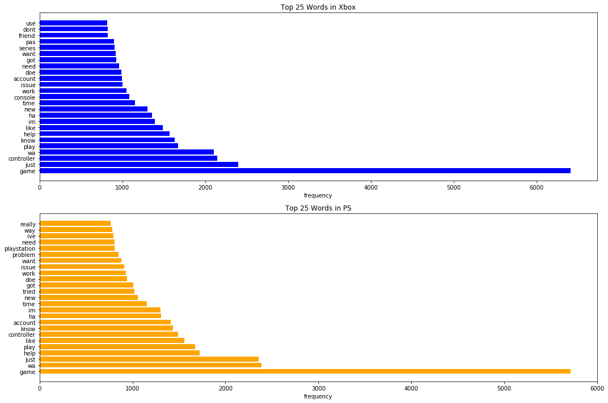

## Understanding Player's Preferences Using Reddit Data
---

### Content 
- [Problem Statement](#Problem-Statement)
- [Executive Summary](#Executive-Summary)
- [Project Files](#Project-Files)
- [Data Directory](#Data-Directory)
- [Data Collection and Cleaning](#Data-Collection-and-Cleaning)
- [EDA and Sentiment Analysis](#EDA-and-Sentiment-Analysis)
- [Modeling](#Modeling)
- [References](#References)

---

### Problem Statement

In the gaming community, there is a great divide between Playstation and Xbox users. One camp boast their robust online community, while the other their exclusive games. Well, imagine being a CEO for an indie company. You have this bright idea for a videogame but do not have enough budget to release it on both platforms. With a typical game costing roughly $40-60 million to make, errors can be financially damaging where game releases are like a gamble. There isn't a guarantee of success. However, a way to resolve this dilemma is to utilize prior knowledge of gamer behavior and preferences. By strategically releasing a game to a platform whose gamer's demographics are more in-line with the game premise, the chances for success are higher, while minimizing cost. Therefore, I conducted an analysis using Xbox One and PS4 subreddits to study gamer's preferences. Using this analysis, I provided recommendations to help indie gaming developers plan their marketing and game development phases. 

---

### Executive Summary

Using the Playstation 4 (PS4) and Xbox One subreddits, I performed a Natural Language Processing in conjunction with a Logistics Regression to capture popular trends observed from each subreddits. Results observed were then utilized to provide indie game developers suggestions that will help strategize the marketing and development phase of their game.

---

### Project Files

- README.md
- Project 3_PS4 and Xbox One Analysis.pdf
- **Code Directory**
    - function.py: Script that contains the functions used in the EDA notebook.
    - 01_data_collection: Notebook that contains code related to collecting data 
    - 02_data_cleaning: Notebook that contains code related to cleaning the data
    - 03_eda_and_sentiment_analysis: Notebook that contains EDA and Sentiment analysis
    - 04_modeling: Notebook that contain modeling code and coefficient analysis
    
---

### Directory

|Feature|Type|Description|
|---|---|---|
|Selftext|string|The body or content of reddit post|
|Title|string|Header/title of reddit post|
|Subreddit|string|Which subreddit the post are taken from xboxone or ps4|

---

### Data Collection and Cleaning

Using the Pushshift API, I collected 20,000 posts from Reddit (10,000 from Xbox One and 10,000 from PS4 subreddits). Due to regulation update of the API, there is a limit of 100 posts per request. Therefore, I embedded a while loop in the data collection function (`get_data`) to get the desired amount. To ensure each request is composed of a new set of posts, I used the oldest/minimum created_utc (decimal equivalent of date) of each pull as the argument for the `.get` method's before parameter. Additionally, I throttled each request for 3 seconds to be polite and comply with rate-limiting policies. Lastly, I added print statements in the function to track the collection status. 

To ensure each posts are from actual users, I check for promotional posts through the author column (Per API's wiki, null values in this column indicate promotional links). Due to the project's scope, I only isolated three columns: selftext, title, and subreddit. I then binarized the target variable (subreddit column) by labeling Xbox posts as 0 and PS as 1. After examining the data, I found that the majority of missing values are in the selftext column. Although missing, it still contains valuable information for the modeling process. Therefore, I converted them into empty strings and concatenated it with the title, creating a new column called "text." Afterward, I passed this newly generated column through two functions. The first one lowercase the words and removes bracket enclosed text, numbers, punctuation, and non-English characters. I also removed common words such as xbox, microsoft, ps, playstation, etc. The second function lemmatizes the terms into their dictionary root form. Due to the removal of non-English characters, I ended up with rows that only containing empty strings. I addressed this issue by converting them into null values and dropping those rows from the dataset. Lastly, I created a document-term matrix by parsing the text column through a CountVectorizer. I then added the subreddit column to the matrix to create a new dataframe. This document-term dataframe and cleaned dataframe are saved into CVS files. 

---

### EDA and Sentiment Analysis

The EDA section is broken down into three categories: Word Count, Top Words, and Sentiment Analysis. For project cohesiveness, orange plots are for the PS subreddit (r/PS4), and blues are for the Xbox (r/xboxone). Lastly, all functions used in this project are in the function.py script.

1. **Word Count:** The average word count for both subreddit is 45 words/posts, where most posts contain 50 words or less. Upon inspection of their distribution, I noticed that the PS subreddit has more posts with 50 words or less, while Xbox has more wordy posts at 50-100 words. Additionally, both subreddits have a right-tail skewed distribution with plenty of outliers for both threads. The longest post is at the PS subreddit with 3651 words, a game review of Ghost of Tsushima. An interesting pattern observed is that longers posts are associated with reviews. A valuable observation is that longer posts in the PS subreddit is mostly about the game The Last of Us of Ghost of Tsushima. 

2. **Top Words:** I decided to examine the top words for both subreddits to understand the kind of topics that are being discussed. Additionally, I wanted to find out what terms are commonly associated with each platform. In both subreddit, the word "game" dominates the thread. Furthermore, it appears that the majority of discussions are about troubleshooting an issue within the platform. Observations seen in this category are expected; for instance, the Xbox subreddit's top words are pass, live, and gold, associated with the Xbox online community. While for PS, it is the word pro, which is related to the PS4 Pro console. 

3. **Sentiment Analysis:**
I conducted a sentiment analysis to capture the attitudes of each subreddit users. The results show that both subreddit posts range from neutral to slightly positive (Xbox polarity: 0.012 and PS polarity: 0.019). Additionally, their subjectivity scores indicate that the PS (0.35) subreddit posts are somewhat more objective and the Xbox (0.38). This observation is surprising since I assumed that posts would be more opinion-based due to Reddit's nature and identity. 

---

### Modeling

I tested three models to classify Reddit posts: Multinomial Naive Hayes, Random Forest Tree, and Logistic Regression. I selected those models because they are white-boxed models with attributes that make their coefficient or Gini impurity interpretable. I defined a successful model as one that beats the baseline score (50%). All models performed similarly to each other, with accuracy scores around 72-74%. Additionally, their sensitivity scores are around 70-75%, and specificity scores are between 71-76%. Since I am most comfortable interpreting Logistic Regression models, I decided to use its coefficient to isolate game titles. 

For the PS subreddit, isolated titles are TLOU (The Last of Us), Uncharted, Ghost of Tsushima, Spiderman, God of War, and Bloodborne. Interestingly, all games mentioned are PlayStation exclusive games and have an action-adventure genre. Additionally, they are known for their storytelling narrative and visually appealing graphics. A possible hypothesis of Playstation gamer's preference is that they value game exclusivity. Moreover, a powerful story component appeals significantly to that target market. To further support this claim, I cross-reference the six games above to an article published by PS4.com about the top-selling games for Playstation 4. Three out of the six games above (The Last of Us, God of War, and Spiderman) are among the list. This evidence solidifies my hypothesis about Playstation user preference.

For the Xbox subreddit, the titles that stood out are Forza, Halo, Fable, Gears of Wars, and Cyberpunk. An interesting similarity between the games is that all five of them have a robust online community. Secondly, except Cyberpunk, these games are Xbox exclusive games. Therefore, a similar hypothesis can be said about Xbox users, where game exclusivity is essential. However, unlike PS4 gamers, they prefer games with an online presence to play with friends. These observations are further emphasized in the top-selling games for Xbox One, according to Gamespot: Forza, Gears of War, Halo, Call of Duty, and Battlefield. These top-selling games have a commonality of being popular due to their online multiplayer options.

---

### Recommendations

My final advice to indie game developers is that exclusivity is a priority. Regardless of console, gamers appear to prefer games exclusive to their chosen platform. Suppose your game has either a good narrative that focuses on character growth or is in the action-adventure genre. In that case, it is better to release it for the Playstation. Horror games will also do well in this console. However, suppose the game is developed with intentions of creating a fun online environment for players. In that case, Xbox is a better console to release it in, especially for shooters and racing games. The suggestions above can be used as guidelines when planning marketing strategies.

This project is not definitive and still has many potentials for improvement. First, I would like to increase the data collected from each subreddits. I would also be interested in adding the PC subreddit to this analysis. Second, I would like to explore more sophisticated modeling techniques to increase accuracy and avoid overfitting. Lastly, I would like to implement a process where inputting the game description into the model will recommend which platform the game will do better in, Xbox or Playstation.

---

### References

- https://kotaku.com/how-much-does-it-cost-to-make-a-big-video-game-1501413649
- https://metro.co.uk/2019/12/05/games-inbox-the-cost-of-making-a-video-game-campo-santo-break-up-and-mario-kart-for-kids-11273380/
- https://www.pushsquare.com/news/2020/07/these_are_the_five_best-selling_ps4_exclusives_in_the_us
- https://www.windowscentral.com/list-xbox-one-best-selling-games-all-time
- https://www.gamespot.com/articles/top-10-best-selling-xbox-one-games-and-exclusives-/1100-6470080/
